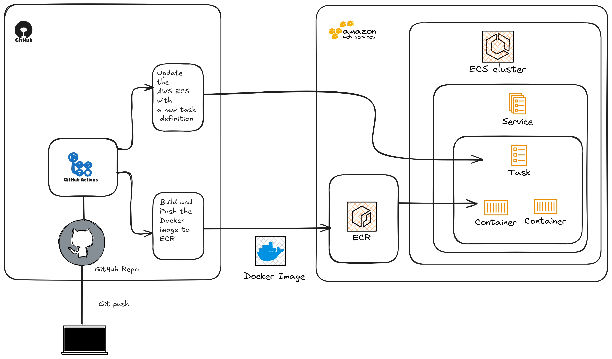
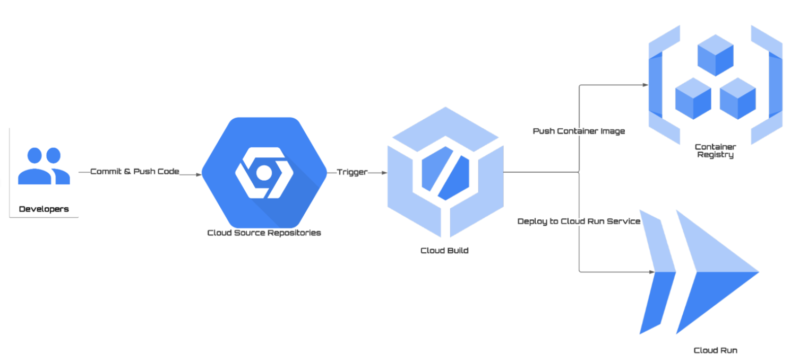

# Real Estate Listings API

A NestJS-based REST API for managing real estate property listings with authentication, filtering, and admin capabilities. The live API documentation can be found [here](https://worksquare-backend-task-562382309128.europe-central2.run.app/api/docs), created with OpenAPI/Swagger documentation.

## 🏗 Architecture Overview

This project follows a modular architecture using NestJS framework:

```
src/
├── admin/          # Admin management module
├── auth/           # Authentication & authorization
├── filters/        # Global exception filters
├── listing/        # Property listings module
└── logger/         # Custom logging middleware
```
### Key Components:
- **Listings Module**: Handles property listing operations with filtering and pagination
- **Admin Module**: Manages admin operations and property creation
- **Auth Module**: JWT-based authentication system
- **Logger**: Custom middleware for request logging

### Database Model

The data model for this API is based on a JSON file structure (`listings.json`) with TypeScript interfaces for type safety. 

#### Data Structure
I created a `Listing` interface to act as a data structure for the data model:    

```typescript
interface Listing {
  id: number;         // Unique identifier for each property
  title: string;      // Property title/description
  image: string;      // Property image URL
  price: string;      // Price (supports various formats including ₦ symbol)
  location: string;   // Property location
  status: string[];   // Property status [type, rental status]
}
```

The interface ensures type safety and provides a contract for the data structure throughout the application. Each property in `listings.json` follows this structure:

```json
{
  "id": 1,
  "title": "4 Bedroom Duplex",
  "image": "property1.jpg",
  "price": "₦2,500,000",
  "location": "Lekki, Lagos",
  "status": ["House", "For Rent"]
}
```

#### Data Flow
1. Data is stored in `listings.json`
2. The `Listing` interface validates the structure
3. `ListingService` uses this interface for type-safe operations

#### Design Decisions
- Using JSON file instead of a database for simplicity
- TypeScript interfaces for type safety
- String format for prices to handle various currency formats
- Array for status to support both property type and rental status

## 🔒 Authentication & Security

### Overview
The API implements a JWT (JSON Web Token) based authentication system using HTTP-only cookies for secure token storage. Authentication is required for admin operations like creating new listings.

### Authentication Flow
1. Admin logs in with email/password
2. Server validates credentials
3. JWT token is generated and stored in HTTP-only cookie
4. Subsequent requests use cookie-based token validation
5. Logout removes the authentication cookie

### Implementation Details

#### Security Measures
- JWT tokens stored in HTTP-only cookies (prevents XSS)
- Passport.js for authentication strategy
- Guards protect admin routes
- Configurable token expiration
- Secure password validation

#### Key Components
```typescript
@Injectable()
export class JwtStrategy extends PassportStrategy(Strategy, 'jwt') {
  constructor(configService: ConfigService) {
    super({
      jwtFromRequest: ExtractJwt.fromExtractors([
        (request: any): string => request?.cookies?.Authentication
      ]),
      secretOrKey: configService.get('JWT_SECRET')
    });
  }
}
```

#### Protected Routes
```typescript
@UseGuards(JwtAuthGuard)
@Post('listings')
async createListing(@Body() createListingDto: CreateListingDto) {
  // Only authenticated admins can access
}
```

### API Endpoints

#### Authentication
- `POST /auth/login` - Admin login
  ```json
  {
    "email": "admin@example.com",
    "password": "password123" // This is hardcoded as there's no use of a persistent database in this task.
  }
  ```
- `GET /auth/logout` - Admin logout

### Environment Variables
```env
JWT_SECRET=your_jwt_secret_key
JWT_EXPIRATION=86400  # 24 hours in seconds
```

### Design Decisions
- Cookie-based JWT storage over localStorage for security
- HTTP-only cookies to prevent client-side access
- Passport.js integration for standardized auth flow
- ConfigService for flexible environment configuration

## 📐 API Design Strategy

### REST Principles
- Resource-based URLs
  ```
  GET    /listing          # List all properties
  GET    /listing/:id      # Get single property
  POST   /admin/listings   # Create new listing
  ```
- HTTP methods for CRUD operations
- Stateless authentication using JWT
- Proper HTTP status codes for responses
- Query parameters for filtering and pagination

### Middleware Stack
1. **Rate Limiting**: This rate limits the api to 100 requests per hour per IP
```typescript
// filepath: src/app.module.ts
ThrottlerModule.forRoot({
  throttlers: [{
    ttl: 60 * 60,  // 1 hour window
    limit: 100     // 100 requests per hour
  }]
})
```

2. **Request Logging**: This custom JSON logger allows logs to be streamed to a log aggregation system (e.g., Logstash, Loki, Datadog)
```typescript
// Custom JSON logger for structured logging
@Injectable()
export class LoggerMiddleware implements NestMiddleware {
  use(req: Request, res: Response, next: NextFunction) {
    logger.log({
      method: req.method,
      url: req.originalUrl,
      ip: req.ip,
      userAgent: req.get('user-agent'),
    });
    next();
  }
}
```

### Error Handling Flow

1. **Custom Exception Filter**
```typescript
export class CustomHttpException extends HttpException {
  constructor(message: string, statusCode: HttpStatus) {
    super({
      statusCode,
      message,
      timestamp: new Date().toISOString(),
    }, statusCode);
  }
}
```

2. **HTTP Status Codes**
- 200: Successful requests
- 201: Resource created
- 400: Bad request
- 401: Unauthorized
- 404: Resource not found
- 429: Too many requests
- 500: Server error

3. **Structured Error Responses**
```json
{
  "statusCode": 404,
  "message": "Listing with ID = 123 not found",
  "timestamp": "2025-06-15T10:00:00.000Z"
}
```

### Request Validation
- DTOs with class-validator
```typescript
export class FilterListingsDto {
  @IsOptional()
  @IsString()
  location?: string;

  @IsOptional()
  @IsNumberString()
  minPrice?: string;

  ...
}
```

### API Documentation
- OpenAPI/Swagger integration
- Decorator-based documentation
```typescript
@ApiOperation({ summary: 'Get all listings with filters' })
@ApiResponse({ 
    status: 200, 
    description: 'Returns paginated list of properties' 
})
```

### Design Decisions
1. **Modular Architecture**
   - Separate modules for listings, admin, and auth
   - Clear separation of concerns

2. **Type Safety**
   - TypeScript interfaces
   - DTO validation
   - Strong typing throughout

3. **Security**
   - Rate limiting
   - JWT authentication
   - Input validation
   - HTTP-only cookies

4. **Monitoring**
   - Structured JSON logging
   - Request tracking
   - Error tracking

5. **Performance**
   - Pagination
   - Query parameter filtering
   - Rate limiting for API protection

## 🚀 Getting Started

### Prerequisites
- Node.js (v16+)
- npm/yarn
- Docker (optional)

### Installation

```bash
# Install dependencies
yarn install

# Run in development
yarn start:dev

# Run in production
yarn start:prod
```
### Main Endpoints:


#### Listings
- `GET /listing` - Get all listings with filters
- `GET /listing/:id` - Get listing by ID

#### Authentication
- `POST /auth/login` - Admin login
- `GET /auth/logout` - Admin logout

#### Admin
- `POST /admin/listings` - Create new listing (Protected)

### API Examples

#### Listing Endpoints with Filters
These examples can be tested on the swagger UI, via `localhost:3000/api/docs` or using the live API documentation.

1. **Basic Pagination**
```http
GET /listing?page=1&limit=10
```

2. **Filter by Location**
```http
GET /listing?location=Lekki
```
Response: Returns properties in Lekki, Lagos

3. **Filter by Property Type**
```http
GET /listing?type=House
```
Response: Returns only houses

4. **Filter by Rental Type**
```http
GET /listing?rentalType=For Rent
```
Response: Returns only rental properties

5. **Price Range Filter**
```http
GET /listing?minPrice=1000000&maxPrice=3000000
```
Response: Returns properties between ₦1M and ₦3M

6. **Combined Filters**
```http
GET /listing?location=Lekki&type=House&rentalType=ForRent&minPrice=2000000&maxPrice=4000000
```
Response example:
```json
{
  "page": 1,
  "limit": 10,
  "total": 2,
  "data": [
    {
      "id": 1,
      "title": "Brand New 4 Bedroom Fully Detached Duplex With BQ",
      "price": "2500000",
      "location": "Lekki, Lagos",
      "status": ["House", "For Rent"],
      "bedrooms": 4,
      "bathrooms": 4,
      "image": "property1.jpg"
    },
    {
      "id": 33,
      "title": "Brand New 4 Bedroom Duplex + BQ",
      "price": "2800000",
      "location": "Osapa, Lekki",
      "status": ["House", "For Rent"],
      "bedrooms": 4,
      "bathrooms": 4,
      "image": "property13.jpg"
    }
  ]
}
```

7. **Shortlet Properties**
```http
GET /listing?rentalType=Shortlet
```
Response: Returns only shortlet properties with weekly/nightly rates

8. **High-End Properties**
```http
GET /listing?minPrice=5000000
```
Response: Returns luxury properties above ₦5M

9. **Budget-Friendly Options**
```http
GET /listing?maxPrice=1000000
```
Response: Returns affordable properties under ₦1M

10. **Location with Price Range**
```http
GET /listing?location=Abuja&minPrice=2000000&maxPrice=4000000
```
Response: Returns properties in Abuja within the specified price range

# 🧪 Testing Strategy

### Unit Tests

The project includes comprehensive unit tests using Jest. Tests cover core functionality of services and controllers.

### Running Tests
```bash
# Run all tests
yarn test

# Watch mode for development
yarn test:watch

# Generate test coverage report
yarn test:cov
```

### Test Coverage Areas

1. **Listing Module**
   - Pagination functionality
   - Filter operations
   - Price range filtering
   - Single listing retrieval

### Testing Tools

- **Jest**: Testing framework
- **@nestjs/testing**: NestJS testing utilities
- **SuperTest**: HTTP testing

## 🐳 Dockerization

### Docker Setup

The application is containerized using a multi-stage build process to minimize the final image size.

### Dockerfile
```dockerfile
# filepath: /Dockerfile
# Stage 1: Build
FROM node:20-alpine AS builder
WORKDIR /app
COPY . .
RUN npm install --frozen-lockfile
RUN npm run build

# Stage 2: Run
FROM node:20-alpine
WORKDIR /app
COPY --from=builder /app/dist ./dist
COPY --from=builder /app/package*.json ./
RUN npm install --omit=dev
CMD ["node", "dist/main"]
```

### Building and Running

```bash
# Build the Docker image
docker build -t real-estate-api .
```
Run with inline environment variables:
```bash
docker run -p 3000:3000 \
  -e JWT_SECRET=your_secret_key \
  -e JWT_EXPIRATION=86400 \
  real-estate-api
```

Or using an environment file:
```bash
# Create .env file
echo "JWT_SECRET=your_secret_key
JWT_EXPIRATION=86400" > .env

# Run with env file
docker run -p 3000:3000 --env-file .env real-estate-api
```
## 🚀 Deployment

The application is deployed using cloud-native container platforms. I implemented two deployment strategies but currently maintain only Cloud Run for cost optimization.

### AWS ECS with Fargate

Initially deployed using AWS ECS (Elastic Container Service) with Fargate for serverless container management.




The deployment workflow:
1. Code is pushed to [GitHub repository](https://github.com/afkzoro/worksquare-backend-task)
2. GitHub Actions triggers the CI/CD pipeline
3. Docker image is built and pushed to Amazon ECR
4. ECS service is updated with the new task definition

```yaml
# filepath: .github/workflows/ci-cd.yaml
name: Deploy to ECS

on:
  push:
    branches: [main]

jobs:
  deploy:
    runs-on: ubuntu-latest
    steps:
      - uses: actions/checkout@v3
      - name: Configure AWS credentials
        uses: aws-actions/configure-aws-credentials@v3
        with:
          aws-access-key-id: ${{ secrets.AWS_ACCESS_KEY_ID }}
          aws-secret-access-key: ${{ secrets.AWS_SECRET_ACCESS_KEY }}
          aws-region: us-east-1

      - name: Build and push to ECR
        run: |
          aws ecr get-login-password --region us-east-1 | docker login --username AWS --password-stdin ${{ secrets.ECR_REGISTRY }}
          docker build -t ${{ secrets.ECR_REGISTRY }}/real-estate-api:latest .
          docker push ${{ secrets.ECR_REGISTRY }}/real-estate-api:latest
```
#### ECS Configuration
- **Compute**: AWS Fargate (serverless)
- **CPU**: 0.5 vCPU
- **Memory**: 1GB
- **Auto-scaling**: 1-3 tasks based on CPU utilization
- **Load Balancer**: Application Load Balancer

### Google Cloud Run (Current)

Currently running on Google Cloud Run for optimal cost-performance ratio.

<!-- Option 2: Using HTML img tag -->


### Deployment Decision

While both platforms performed well, I chose to maintain only the Cloud Run deployment due to:

1. **Cost Optimization**
   - Pay-per-use pricing
   - No minimum instance requirement
   - Automatic scale to zero

2. **Simplicity**
   - Built-in CI/CD integration
   - Automatic HTTPS
   - Simpler configuration

3. **Performance**
   - Cold start optimization
   - Global CDN integration
   - Automatic scaling

### Monitoring & Logging

- **Cloud Run Metrics**
  - Request latency
  - Container instance count
  - Memory utilization
  - Concurrent requests

- **Logging**
  - Structured JSON logs
  - Error tracking
  - Request tracing

### Access the API

The API is currently accessible at:
```
https://worksquare-backend-task-562382309128.europe-central2.run.app/api/docs
```

> [!IMPORTANT]
> The ECS deployment configuration is maintained in the repository for reference and potential future scaling needs.*